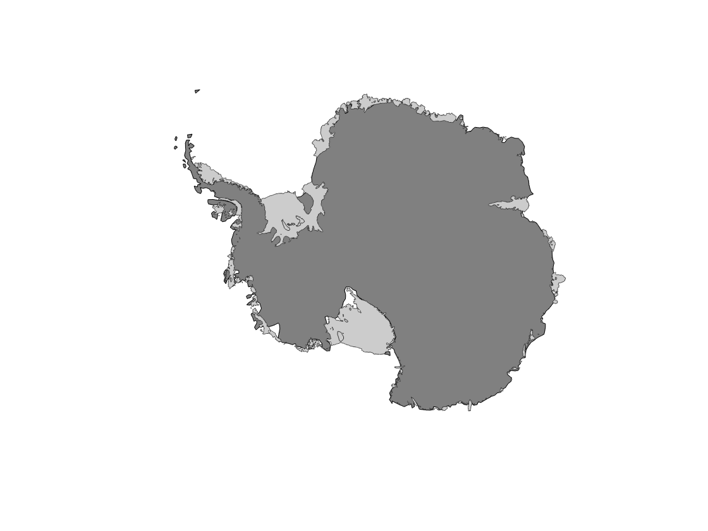
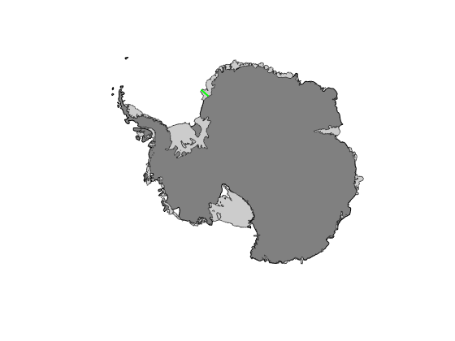
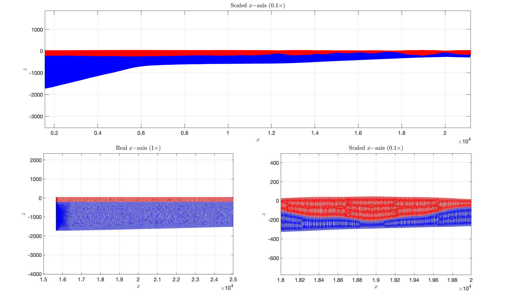
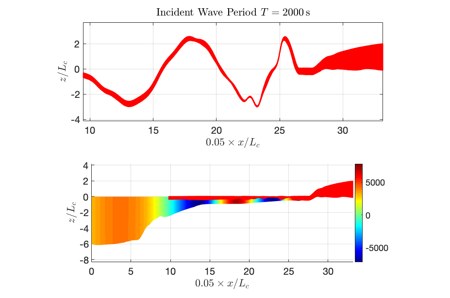
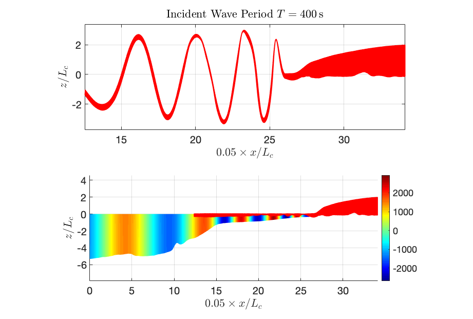
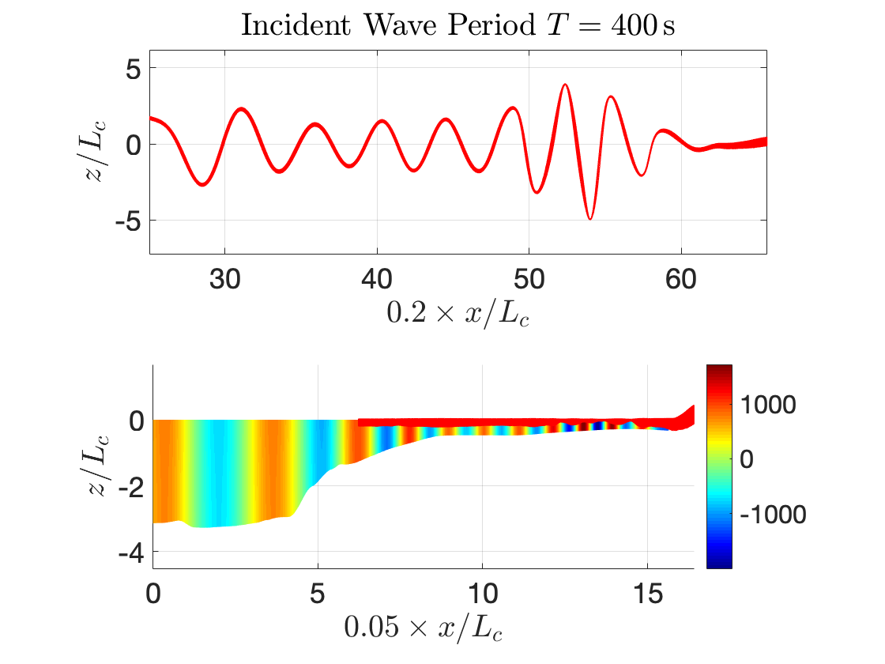

# iceFEM++

## Introduction

To use iceFEM++, you must have FreeFem++ installed. Currently, the
program is written to model vibrations of ice-shelves (1D, 2D and 3D), an
example of a fluid-structure interaction problem. The schematic and
the governing equations are shown in the Figure below.

| 
| ----------------------------------

To setup and use the package, cd into the package directory, open up terminal and type

```shell
export FF_INCLUDEPATH="$PWD/include" #Add the include/ folder into the FreeFem++ environment variable. Needs to be run for the first time.
FreeFem++ -ne simple1.edp
```

More examples are located in the `examples/` folder. The script file `genDir.sh` is used to generate the directories used by the FreeFem++ routine to write the appropriate files.
```shell
chmod +x genDir.sh
./examples/genDir.sh 1_Forced
./examples/genDir.sh 1_ThinPlate
./examples/genDir.sh 1_DirectFEM
```

Use this before testing the examples. The last command computes the solution for a default uniform ice-shelf and cavity with

* Length L=20 km
* Thickness h=200 m
* Cavity Depth H=800 m
* Incident Wave period T=200 s

To specify more inputs, one can use the following command

```shell
FreeFem++ -ne -v 0 simple1.edp -L [LENGTH] -H [DEPTH OF CAVITY] -h [THICKNESS OF ICE]
                                 -N [MESH PARAM]
                                 -Tr [REAL(period)] -Ti [IMAGE(period)]
                                 -iter [SOL. INDEX]
                                 -isUniIce [ON/OFF UNIFORM/NON UNIFORM ICE]
                                 -isUniCav [ON/OFF UNIFORM/NON UNIFORM CAVITY]
                                 -isForced [ON/OFF SHELF-FRONT FORCES]
```

**Example: Run**

```shell
FreeFem++ -ne -v 0 simple1.edp -L 10000 -H 800 -h 200 -N 4 -Tr 100 -Ti 0 -iter 0 -isUniIce 1 -isUniCav 1 -isForced 0    

FreeFem++ -ne -v 0 simple1.edp -L 15000 -H 800 -h 200 -N 4 -Tr 200 -Ti 0 -iter 0 -isUniIce 1 -isUniCav 0 -isForced 0
```

MATLAB can be used to visualize the solution generated using FreeFem++. A FreeFem++ to MATLAB converter is available online. If using this package, the required files are located in the `modules/` directory. To generate good PDF plots, it is recommended to use `export_fig` MATLAB package. To visualize the solution obtained by FreeFem++, we use this MATLAB code:

```Matlab
% From the FreeFem to MATLAB converter.
[pts1,seg1,tri1] = importfilemesh('1_Forced/2_Deformation/movedIce0.msh');
[pts2,seg2,tri2] = importfilemesh('1_Forced/2_Deformation/cavityMesh.msh');
PHILE = importfiledata('1_Forced/2_Potential/potential0.bb');
% Plot using PDEPLOT
figure(1)
subplot(2,1,1);
pdeplot(pts1,seg1,tri1)
axis equal tight
grid on
subplot(2,1,2)
pdeplot(pts2,seg2,tri2,'XYData',real(PHILE)','colormap','jet');
```
The following plots are generated.

  |  |  |
  | ---------------------------------- | ------------------------------ |

The Reflection Coefficients are tabulated below.

  | Reflection Coefficient, R | abs(R)  |
  | ---------------------------------- | ------------------------------ |
  | (0.8507259058288464,0.525609582438974) | 0.9999999999999919 |
  | (-0.3166231272563836,0.9485514194213012) | 0.9999999999998886 |

## Demo Scripts
There are demo MATLAB scripts located in the `examples/` folder that are written to generate the plots shown below.
```Matlab
thinVsFull.m
femEBvsFull.m
leSolu.m
refCoeff_cplx.m
timeDomain.m
```

**NOTE: Before using the MATLAB scripts, it is essential to run the `genDir.sh` script to generate the following directories.**

```shell
./genDir.sh 1_Forced
./genDir.sh 1_ThinPlate
./genDir.sh 1_DirectFEM
```

**WARNING: `refCoeff_cplx.m` computes the Analytic extension of the solution for complex frequencies. `timeDomain.m` computes the solution in the time domain from the frequency domain solution. These routines compute the solution for a large number of incident frequencies and hence take a long time to run on a personal laptop.**

There are different ice-shelf examples that can be solved.

1. `iceshelf_submerged_moving.edp` assumes that the ice--shelf is a
  1D thin-plate and the vibrations are modelled using the
  Euler-Bernoulli beam theory. The vibration of the ice-shelf and the
  velocity potential in the cavity region for an
  incident wave-forcing of 200 s (in the frequency domain) is shown below. Figure on the left shows the solution on a non uniform cavity and on the right, the solution on a uniform cavity. In this case, the problem is solved using the modal expansion technique, which is used for solving hydro-elasticity problems of large container ships. To use this module, generate the appropriate directory by running

  ```shell
  mkdir -v 1_ThinPlate
  ```

  |  |  |
  | ---------------------------------- | ------------------------------ |


2. `iceSpline.edp` uses the 2D linear elasticity equations under plane strain
  conditions for the ice-shelf. Figure on the left shows the finite element meshes used for the cavity and the ice-shelves (both non-uniform).
  The governing equations are solved using the combined approach of modal expansion and the finite element method. Run

  ```shell
  ./genDir.sh 1_Forced
  ```

  to generate the solution directories before running the solver.

  |  |  |
  | ---------------------------------- | ------------------------------ |  

3. `icefem.edp` is used to solve the coupled problem on uniform meshes. Since the mesh points match exactly at the shelf/cavity interface, the coupled problem is solved directly using the finite element method without modal expansions.  To generate the appropriate directories, run

```shell
./genDir.sh 1_DirectFEM
```

The solution to the linear elasticity problem agrees with the thin-plate solution when the ice-shelf is uniform and thin!

|  |  |
| ---------------------------------- | ------------------------------ |

## BEDMAP2 Integration

Real-life ice-shelf profiles can be obtained using the BEDMAP2 dataset to generate the finite element meshes. Download the BEDMAP2 dataset [here](https://www.mathworks.com/matlabcentral/fileexchange/42353-bedmap2-toolbox-for-matlab).

### Example 1:
To generate the profiles, run `bedMapProfile.m`. A map of Antarctica along with the ice-shelves appears.

| 
| ----------------------------------

Click two points on the map to define a path as shown. Undo points by hitting **Backspace**. When you're satisfied with a path you've drawn, hit **Enter** to create a profile. To quit the user interface without creating a profile, hit **Esc**.

|  |  |
| ------------------------------ | ------------------------------ |

The program generates 3 profiles:

1. The top section of the ice-shelf,
2. The submerged section of the ice-shelf,
3. The seabed profile of the cavity underneath the ice-shelf.

The description of the cubic-spline curve describing these profiles will be written to files located in `Meshes/BEDMAP2` folder. The cubic-spline curve will then be re-constructed in FreeFem++ to parametrize the curves and generate the meshes. The parametrization is done by the function
```cpp
func real splineRecon(real[int, int], real[int], real, int){
  :
}
```
in `include/spline.idp`. The program `iceShelfBEDMAP2.edp` uses this parametrization and generates the meshes which is written as `Meshes/iceMeshBEDMAP.msh` and `Meshes/cavMeshBEDMAP.msh`. Figure below shows the mesh for the profile shown in the previous Figure.

||
| ------------------------------ |

The top panel shows the overall profile of the shelf and cavity generated by FreeFem++. The middle and the right panel shows the mesh in the seaward end and a section close to the land, respectively. The distance units are shown in meters (m). Some images are scaled down for better visualization.

**NOTE: To use the mesh, a coordinate shift is required to set the front (seaward) portion of the ice-shelf at `x=0`. The free-surface of the open-ocean at the seaward end is at `z=0`, which gives information about the submergence of the ice-shelf.**

## Example 2:

This is a more general example which involves extending the cavity region beyond the ice-shelf. The example is programmed in the ```bedMapProfile2.m``` script. The start and the end point is requested from the user as in Example 1, but the mesh for the cavity region is constructed for a length beyond the ice. This involves solving the Laplace equation for the potential region with the free surface boundary condition on the open ocean region of the finite element domain. The FreeFem++ program is found in ```solveBEDMAP2.edp```. The following example shows the deformation and the velocity potential for the Brunt Ice Shelf. The program can be run on a personal laptop and takes about ```20 min``` to run on a mid-2014 MacBook Pro (Significant time is spent in importing the meshes).

The following Figures show the solution for the wave-forcing of the Brunt-Ice Shelf. The scales are chosen as follows. The base of the ice is fixed beyond the region where the cavity ends and vibrations are not observed in that location.

1. The `x-axis` is shrunk by a factor of `0.05*1/Lc`, where `Lc` is the characteristic length of the ice-shelf obtained by the non-dimensionalization of the problem.
2. The `y-axis` is shrunk by a factor of `1/Lc`.
3. The deformation of the ice-shelf in the plots are however, dimensional and is expressed in meters `m`.

||  |  |
| ------------------------------------ | --- | --- |
|R=(0.1019503214671236,0.9961634316870296)| R = (0.3447918251722392,-0.9404886412629517) | R = (0.759311160623101,-0.6549410544078146) |
|abs(R)=1.001366791279664|abs(R) = 1.001698700733028 | abs(R) = 1.002746839135193 |

The reflection coefficients are shown below. Note that the reflection coefficient is not exactly equal to 1. Either the current code is *buggy* or a detailed convergence study might be required. Refer to the manual for more details **(Not Updated, Stay Tuned)**.

## Coming soon
Will support 3D models in the future. Some examples currently in the works are shown below.

 |  |  |
 | ---------------------------------- | ------------------------------ |

More coming soon.

Contact: Balaje K,  Email: [balaje6@gmail.com](mailto:balaje6@gmail.com)
