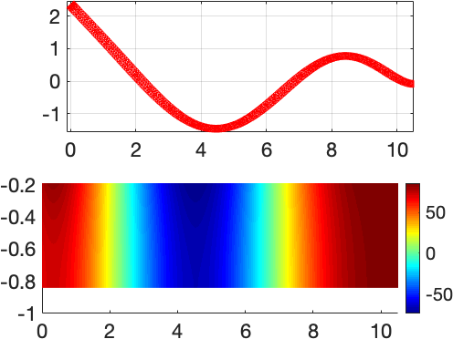
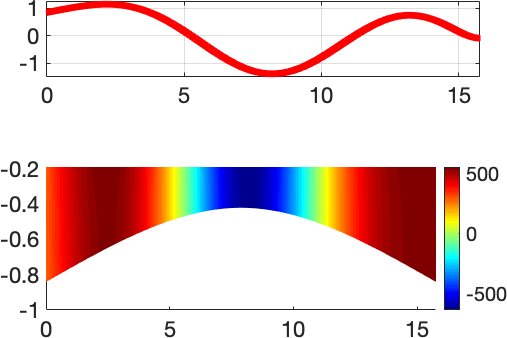
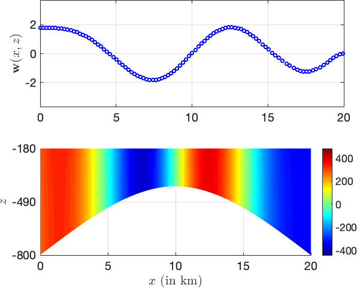
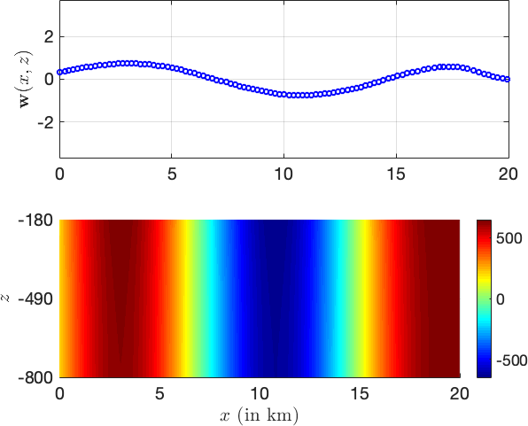
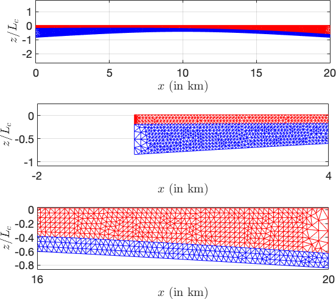
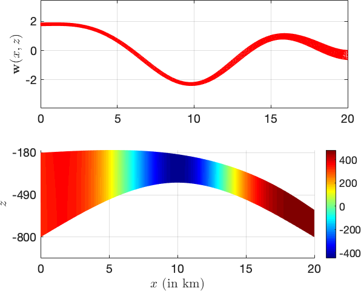
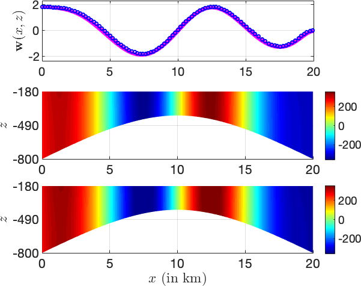
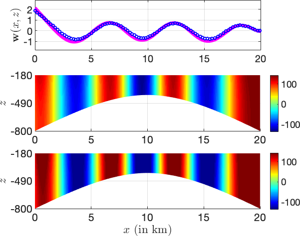
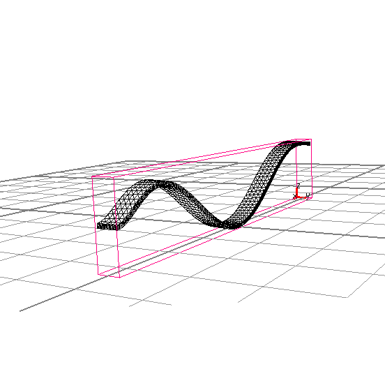

# iceFEM++

To use iceFEM++, you must have FreeFem++ installed. Currently, the
program is written to model vibrations of ice-shelves (1D, 2D and 3D), an
example of a fluid-structure interaction problem. The schematic and
the governing equations are shown in the Figure below.

<p style='text-align: center;'>

</p>

To use the package, open up terminal and type

```shell
FreeFem++ -ne iceSpline.edp
```

This computes the solution for a default uniform ice-shelf and cavity with

* Length L=20 km
* Thickness h=200 m
* Cavity Depth H=800 m
* Incident Wave period T=200 s

To specify more inputs, one can use the following command

```shell
FreeFem++ -ne -v 0 iceSpline.edp -L [LENGTH] -H [DEPTH OF CAVITY] -h [THICKNESS OF ICE]
                                 -N [MESH PARAM]
                                 -Tr [REAL(PERIOD)] -Ti [IMAGE(period)]
                                 -iter [SOL. INDEX]
                                 -isUniIce [ON/OFF UNIFORM/NON UNIFORM ICE]
                                 -isUniCav [FLAG TO INDICATE UNIFORM/NON UNIFORM CAVITY]
                                 -isForced [ON/OFF SHELF-FRONT FORCES]
```

**Example: Run**

```shell
>>> FreeFem++ -ne -v 0 iceSpline.edp -L 10000 -H 800 -h 200 -N 4 -Tr 100 -Ti 0 -iter 0 -isUniIce 1 -isUniCav 1 -isForced 0                                            
>>> FreeFem++ -ne -v 0 iceSpline.edp -L 15000 -H 800 -h 200 -N 4 -Tr 200 -Ti 0 -iter 0 -isUniIce 1 -isUniCav 0 -isForced 0
```

MATLAB can be used to visualize the solution generated using FreeFem++. A FreeFem++ to MATLAB converter is available online. If using this package, the required files are located in the `modules/` directory. To generate good PDF plots, it is recommended to use `export_fig` MATLAB package. To visualize the solution obtained by FreeFem++, we use this MATLAB code:

```matlab
% From the FreeFem to MATLAB converter.
[pts1,seg1,tri1] = importfilemesh('1_Forced/2_Deformation/movedIce0.msh');
[pts2,seg2,tri2] = importfilemesh('1_Forced/2_Deformation/cavityMesh.msh');
PHILE = importfiledata('1_Forced/2_Potential/potential0.bb');
% Plot using PDEPLOT
figure(1)
subplot(2,1,1);
pdeplot(pts1,seg1,tri1)
axis equal
axis equal tight
grid on
subplot(2,1,2)
pdeplot(pts2,seg2,tri2,'XYData',real(PHILE)','colormap','jet');
```
The following plots are generated.

|  |  |
| ---------------------------------- | ------------------------------ |

The Reflection Coefficients are tabulated below.

| Reflection Coefficient, R | abs(R)  |
| (0.8507259058288464,0.525609582438974) | 0.9999999999999919 |
| (-0.3166231272563836,0.9485514194213012) | 0.9999999999998886 |
| ---------------------------------- | ------------------------------ |

**NOTE:** `refCoeff_cplx.m` **computes the Analytic extension of the solution for complex frequencies. The routine computes the solution for a large number of incident frequencies and hence takes a long time to run on a personal laptop.**

There are different ice-shelf examples that can be solved.

1. `iceshelf_submerged_moving.edp` assumes that the ice--shelf is a
1D thin-plate and the vibrations are modelled using the
Euler-Bernoulli beam theory. The vibration of the ice-shelf and the
velocity potential in the cavity region for an
incident wave-forcing of 200 s (in the frequency domain) is shown below. Figure on the left shows the solution on a non uniform cavity and on the right, the solution on a uniform cavity. In this case, the problem is solved using the modal expansion technique, which is used for solving hydro-elasticity problems of large container ships.

|  |  |
| ---------------------------------- | ------------------------------ |


2. `iceSpline.edp` uses the 2D linear elasticity equations under plane strain
conditions for the ice-shelf. Figure on the left shows the finite element meshes used for the cavity and the ice-shelves (both non-uniform).
The governing equations are solved using the combined approach of modal expansion and the finitie element method.

|  |  |
| ---------------------------------- | ------------------------------ |

The solution to the linear elasticity problem agrees with the thin-plate solution when the ice-shelf is uniform and thin!

|  |  |
| ---------------------------------- | ------------------------------ |


MATLAB routines

assist with the visualization of the solution. Will support 3D models in the future. Some examples currently in the works are shown below.

|  |  |
| ---------------------------------- | ------------------------------ |

More coming soon.

Contact: Balaje K,  Email: [balaje6@gmail.com](mailto:balaje6@gmail.com)
