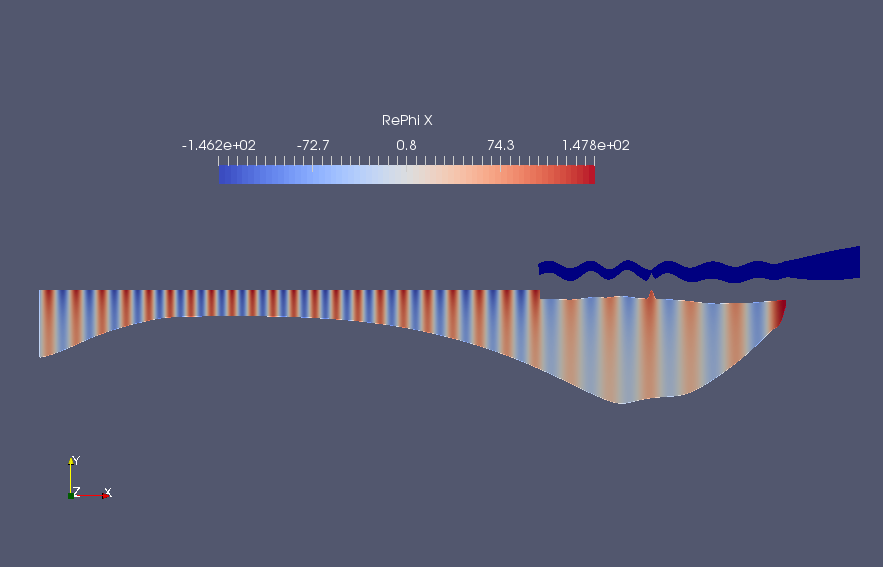
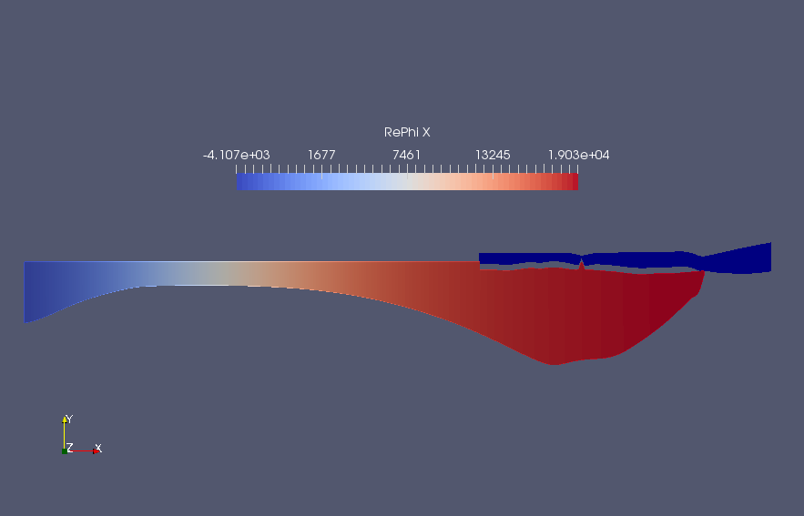

# iceFEM++

## Introduction

This iteration of iceFEM implements the algorithms in parallel with an aim to solve bigger problems. For the main branch visit the link [here](https://github.com/Balaje/iceFem/tree/master). The schematic and
the governing equations remain the same as the previous version and is shown in the Figure below.

| 
| ----------------------------------

To setup and use the package, cd into the package directory, open up terminal and type

```shell
export FF_INCLUDEPATH="$PWD/include" #Add the include/ folder into the FreeFem++ environment variable. Needs to be run for the first time.
./genDir.sh 1_SIMPLE5/
mpirun -np 4 FreeFem++-mpi -v 0 simple5.edp
```

The second command creates the necessary directory structure for organising the solution better. The last command computes the solution for a default uniform ice-shelf and cavity with

* Length L=20 km
* Thickness h=200 m
* Cavity Depth H=800 m
* Incident Wave period T=200 s

To specify more inputs, one can use the following command

```shell
mpirun -np 4 FreeFem++-mpi -ne -v 0 simple5.edp -L [LENGTH] -H [DEPTH OF CAVITY] -h [THICKNESS OF ICE]
                                 -N [MESH PARAM]
                                 -Tr [REAL(period)] -Ti [IMAGE(period)]
                                 -iter [SOL. INDEX]
                                 -isUniIce [ON/OFF UNIFORM/NON UNIFORM ICE]
                                 -isUniCav [ON/OFF UNIFORM/NON UNIFORM CAVITY]
                                 -isSplit [ON/OFF DOMAIN SPLITTING]
                                 -notchHeight [HEIGHT_FRAC_THICKNESS]
                                 -notchWidth [HEIGHT_FRAC_THICKNESS]
                                 -notchLoc [LOC_FRAC_LENGTH]
```

**Example: Run**

```shell
mpirun -np 4 FreeFem++-mpi -ne -v 0 simple5.edp -L 10000 -H 800 -h 200 -N 4 -Tr 200 -Ti 0 -iter 0 -hsize 0.01 -isSplit 1  
```

The parameter ``hsize`` is used in uniform refinement of the ice and cavity meshes and is used by the macro ```refineMesh```. A better method will be added in future releases. Splitting is employed to parallelise the computation of the reduced system. For a set of space-dimensional parameters for example, length, thickness of the ice shelf, splitting can be done once. This is achieved using the macro,

``` shell
splitMeshSave;
```

This sets up a set of interpolation matrices that will be used to construct the reduced system and will be saved in a folder named ```MESHES_SPLIT```. The split mesh data is loaded via the macro,

```shell
splitMeshLoad;
```

The following data for the reflection coefficient is obtained.

| Reflection Coefficient, R | abs(R) |
----- | ---- |
| (0.792773933482978,0.6095157835447178) | 1.000000000000102 |

All the visualization is performed using Paraview. The code produces the following outputs for the displacement field and the velocity potential in the cavity region.

| Displacement | real(Velocity Potential)|
| --- | ---- |
|   |  |


## BEDMAP2 Integration

Real-life ice-shelf profiles can be obtained using the BEDMAP2 dataset to generate the finite element meshes. Download the BEDMAP2 dataset [here](https://www.mathworks.com/matlabcentral/fileexchange/42353-bedmap2-toolbox-for-matlab). The BEDMAP2 dataset is integrated with the code in a similar fashion to the [main branch](https://github.com/Balaje/iceFem/tree/master#bedmap2-integration). The profiles are generated using the MATLAB code ```bedMapProfile.m```. Once the profiles are generated, the resulting problem could be solved using the FreeFem code.

A sample profile has been added in the ```Meshes/BEDMAP2/``` folder. The sample profiles include the cavity region beyond the ice shelf. Run the following command to generate the solution for two incident wave periods.

```shell
mpirun -np 4 FreeFem++-mpi -ne -v 0 solveBEDMAP2.edp -nborders 6 -isMesh 1 -iter 1 -hsize 0.02 -Tr 50 -notchHeight 0.0 -N 12
mpirun -np 4 FreeFem++-mpi -ne -v 0 solveBEDMAP2.edp -nborders 6 -isMesh 0 -iter 0 -hsize 0.02 -Tr 5000 -notchHeight 0.0 -N 12
```

and it produces the following outputs. Note the scales along the ``y`` axis is exaggerated for better visualization.

| T=50 s | T=5000 s |
| --- | --- |
|  |  |

The reflection coefficients are tabulated below

T | Reflection Coefficient, R | abs(R) |
---| ---- | ---- |
50 s| (-0.6127195477019034,-0.7903004212727593) | 0.999999999999963 |
5000 s | (-0.8500749126487752,-0.5266617918155339) | 1.000000000036586 |


The number of DOFs and other data are shown below.

```
Cavity : Before Refinement, NBV = 7041
Ice : Before Refinement, NBV = 2393
Cavity : After Refinement, NBV = 236077
Ice : After Refinement, NBV = 45467
Number of in--vacuo modes = 64
Time to solve per problem = 16.5614

Total Time ~ 400-420 s (Without mesh construction)
```

I have also added support for adding artificial notches in the ice shelf. This is to simulate rifts in the ice which may accelerate calving in the ice. This is done by specifying parameters

```shell
-notchHeight [HEIGHT_FRAC_THICKNESS]
-notchWidth [HEIGHT_FRAC_THICKNESS]
-notchLoc [LOC_FRAC_LENGTH]
```
where ``*_FRAC`` denotes the fraction of thickness/length. For example ```-notchHeight 0.8``` is a notch whose height is equal to 80% of the shelf thickness. Running the code for two incident wave periods produces the following results.

| T=50 s | T=5000 s |
| --- | --- |
|  |  |

The reflection coefficients are roughly similar since the notch can be considered to be a small perturbation of the original solution without the notch.

T | Reflection Coefficient, R | abs(R) |
---| ---- | ---- |
50 s| (-0.6399984548546397,-0.7683761954820765) | 0.9999999999999183 |
5000 s | (-0.864578758274102,-0.502497333987288) | 0.9999999999615601 |


## Coming soon
Will support 3D models in the future. Some examples currently in the works are shown below.

 |  |  |
 | ---------------------------------- | ------------------------------ |

More coming soon.

Contact: Balaje K,  Email: [balaje6@gmail.com](mailto:balaje6@gmail.com)
