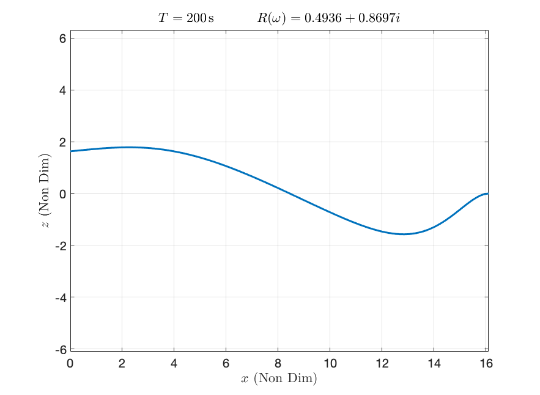
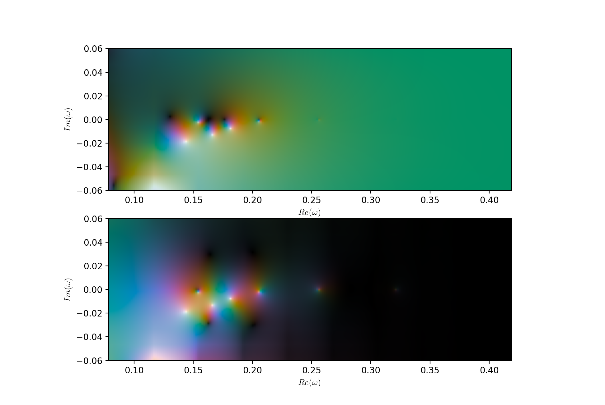
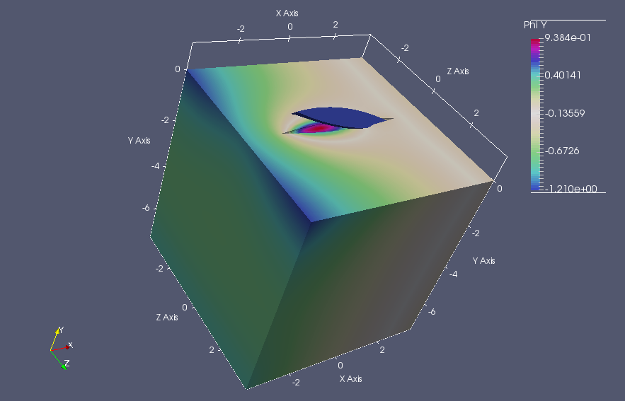

# iceFEM++

## Dependencies
- [**FreeFem**](https://freefem.org): A high level multiphysics finite element software. Full version with the `MPI` implementation and the `ffddm` module is required. The full version can be downloaded from the official website.

- [**Bedmap2 Toolbox**]: Support yet to be provided.

- **Python:** Requires Python support with `numpy`, `scipy` `matplotlib` and `cplot`, the last one for generating complex plots. Can be installed using
```shell
pip3 install cplot
```

- **Unix based OS:** Currently this program is written assuming a Unix based Operating system. Future support for windows will be added.

## Introduction

This iteration of iceFEM implements the algorithms in parallel with an aim to solve bigger problems. For this implementation, the program requires the ``MPI`` version of FreeFem installed. If the full program is installed, the parallel version is available by default. For the main branch visit the link [here](https://github.com/Balaje/iceFem/tree/master). The schematic and
the governing equations remain the same as the previous version and is shown in the Figure below.

| 
| ----------------------------------

**A few sample programs are discussed below to get you started**. To setup and use the package, cd into the package directory, open up terminal and type

```shell
export FF_INCLUDEPATH="$PWD/include" #Add the include/ folder into the FreeFem++ environment variable. Needs to be run for the first time.
./genDir.sh [YOUR_DIRECTORY NAME]
```

The `genDir.sh` script creates the directory structure used by the package to write the relevant files. For example running

```shell
./genDir.sh 1_SIMPLE5
```
produces the following directories inside.

``` shell
1_SIMPLE5/ # This folder also contains the VTK files for visualizing the FreeFem solution.
├── 2_Deformation
├── 2_Modes # To store in-vacuo modes
├── 2_ModesMatrix # [FEM] To store the reduced system.
│   ├── Interpolated_F # [MATLAB] Store the interpolated RHS value
│   ├── Interpolated_H # [MATLAB] Store the interpolated LHS value
│   └── Interpolated_L # [MATLAB] Store the interpolated solutions $\lambda_j$
├── 2_Potential # To store the radiation and diffraction potentials
├── 2_RefCoeff # [FEM] To store the reflection coefficients
│   ├── Interpolated_R # [MATLAB] To store the interpolated values of the Difraction and radiation reflection coefficients.
│   ├── RefCoeff_Dif # [FEM] To store the Diffraction reflection coefficients
│   └── RefCoeff_Rad # [FEM] To store the Radiation reflection coefficients
└── 2_Stresses # [FEM] To store the stresses
```
The default directory name can be changed in the FreeFem code by setting the variable `SolutionDir`. Run
```shell
mpirun -np 2 FreeFem++-mpi -v 0 iceshelf2d.edp -nev 16 -Tr 80 -hsize 0.05 -notchHeight 0.0 -isUniRef 0 -isSplit 1 -N 15
```
This command command computes the solution for a default uniform ice-shelf and cavity with

* Length L=20 km
* Thickness h=200 m
* Cavity Depth H=800 m
* Incident Wave period T=200 s

To specify more inputs, one can use the following command

```shell
mpirun -np 2 FreeFem++-mpi -ne -v 0 simple5.edp -L [LENGTH] -H [DEPTH OF CAVITY] -h [THICKNESS OF ICE]
                                 -N [MESH PARAM]
                                 -Tr [REAL(period)] -Ti [IMAG(period)]
                                 -iter [SOL. INDEX]
                                 -isUniIce [ON/OFF UNIFORM/NON UNIFORM ICE]
                                 -isUniCav [ON/OFF UNIFORM/NON UNIFORM CAVITY]
                                 -isSplit [ON/OFF DOMAIN SPLITTING]
                                 -notchHeight [HEIGHT_FRAC_THICKNESS]
                                 -notchWidth [HEIGHT_FRAC_THICKNESS]
                                 -notchLoc [LOC_FRAC_LENGTH]   
                                 -isUniRef [ON/OFF Uniform Refinement]                              
```

The non-uniform refinement is performed proportional to shelf thickness. To specify the dimension of the problem and the polynomial order of approximation, define the following macros in the code

```cpp
macro dimension 2//EOM" (dim=2)
macro fspace 2//EOM" (fespace=P2)
```

to solve a 2D problem using quadratic triangular elements. Note that FreeFem offers support only for triangles/tetrahedrons. The non-local boundary condition has been extended to accommodate  more general cases.


**Example 1: Ice shelf motion**

```shell
./genDir.sh 1_SIMPLE5
mpirun -np 4 FreeFem++-mpi -ne -v 0 iceshelf2d.edp -L 10000 -H 800 -h 200 -N 10 -Tr 200 -Ti 0 -iter 0 -hsize 0.04 -isSplit 1
```

The parameter ``hsize`` is used in uniform refinement of the ice and cavity meshes and is used by the macro ```refineMesh```. A better method will be added in future releases. Splitting is employed to parallelise the computation of the reduced system. For a set of space-dimensional parameters for example, length, thickness of the ice shelf, splitting can be done once. This is achieved using the macro,

``` cpp
splitMesh(isSplit);
```
where ```isSplit``` is a global variable that indicates whether the splitting is active or not. The splitting macro will split the mesh and distribute the sub-meshes among the processors. The following data for the reflection coefficient is obtained. The thin-plate solution is shown as comparison to the FEM result.

Model | Reflection Coefficient, `R` | abs(`R`) |
---- |----- | ---- |
FEM | (0.482959,0.875643) | 1.000000 |
Thin Plate| (0.493626,0.869740) | 1.000000 |

All the visualization is performed using Paraview. The code produces the following outputs for the displacement field and the velocity potential in the cavity region. **NOTE: The Thin-plate code has been validated using the `MATLAB` module located in the other branch**.

| Displacement/Potential (FEM) | Displacement (ThinPlate) |
| --- | ---- |
|   |  |


**Example 2: Floating elastic plate Motion**

Run:
```shell
./genDir.sh 2_ICEBERG
mpirun -np 2 FreeFem++-mpi -v 0 iceberg.edp -N1 20 -N2 30 -Tr 40 -L 3000 -H 2000 -h 200 -nev 8 -iter test
```
solves the floating elastic plate vibration problem for an incident period of ``T=40s``. The output is shown in the Figure below:


The reflection (`R`) and transmission (`T`) coefficients are shown in the Table below:

T(in s) | `R`(omega) | `T`(omega) | abs(`R`)^2+abs(`T`)^2 |
--- | --- | --- | --- |
T=40 s | (0.475792,-0.647576) | (0.479653,0.352414) | 1.00000 |

which verifies the energy conservation result. Note that the transmission coefficient `T=0` in ice--shelf case since there is no transmission. The Q-operator boundary condition is applied on both the ends while the wave forcing function is applied only on the left hand side (inlet boundary).

## Python Functions

A list of functions written using Python has been added to perform interpolation to generate the interpolated frequency-domain solutions after obtaining the finite element solutions.

```python
# Details of the function to be added
def interpolateCoeffsFreq(a,b,omega,Nev,filePath,npts,isSolve):  
def interpolateCoeffsFreqComplex(a,b,c,d,npts,Nev,filePath,nptsNew):
def interpolateRefCoeff(omega,omegaNew,Nev,filePath,TorC):
def interpolateRefCoeffComplex(a,b,c,d,npts, Nev, filePath, TorC, nptsNew):
def buildLam(SolutionDir):  
def buildRMat(LAM,SolutionDir,TorC):   
```

Example scripts demonstrating the use of the Python Functions are provided.
- `RealRefIce.py`: Computes and plots the Reflection and Transmission coefficients (Refer to the image on the paper). The Green line verifies the energy conservation result
```shell
abs(R)^2+abs(T)^2 = 1
```

  

- `ComplexRefIce.py`: Computes and plots the Reflection and Transmission coefficients on the complex frequency space.

  


## 3D Problems

3D problems are much more challenging to solve that 2D problems. The eigenmode decomposition of the ice-shelf typically consists of lower order vibration modes in the third direction. The modal decomposition often yield these vibration modes in an arbitrary order and thus simple solutions to the frequency domain problems are often harder to approximate. Hence, more analysis (including validation) is required to study these problems in detail. Nevertheless, preliminary support has been extended to 3D cases as well.

All the macros should work if the correct dimension has been specified and the correct meshes are being used. Example meshes are available in ```Meshes/*.mesh```. The associated FreeFem script is `iceshelf3d.edp`.

| Floating boat | 3D ice-shelf |
| --- | --- |
|  |  |

The first example is that of a floating boat which is an extension to an elastic plate problem in 2D. A detailed description of the geometry and the solution method can be found in this link here. The inlet and the outlet faces are prescribed by the user by specifying the appropriate labels. In this case, there is exactly one inlet (front plane, outward from the plane of the paper) and one outlet boundary (back, into the plane of the paper). No normal flow is prescribed on the sides and the bottom. The top surface is assigned as a free-surface.

The second example is that of a classic ice-shelf vibration problem. The example here shows the vibration of a uniform ice-shelf of length 20 km and 200 m thick placed over a cavity of depth 500 m. The shelf is subjected to an incident wave forcing of 4000 s. The gray surface shows the 2D elasticity solution obtained using the same code. As mentioned earlier, there is a little bit of in-plane displacement along the third direction due to the contribution of the in-plane modes. Nevertheless, a good qualitative agreement is observed for the lower modes. This repository will be updated as more studies are conducted.

## To-do

- Python implementation of the thin-plate solution module using Eigenfunction Matching Method.

- BEDMAP2 Support using Python.

- Documentation of the Python Module.

## Acknowledgement
This is joint work with my supervisors:

- [Mike Meylan](https://www.newcastle.edu.au/profile/mike-meylan), University of Newcastle.
- [Bishnu Lamichhane](https://www.newcastle.edu.au/profile/bishnu-lamichhane), University of Newcastle.
- [Luke Bennetts](https://luke-bennetts.com/), University of Adelaide.

## Contact:
- Balaje K,  [balaje6@gmail.com](mailto:balaje6@gmail.com)
