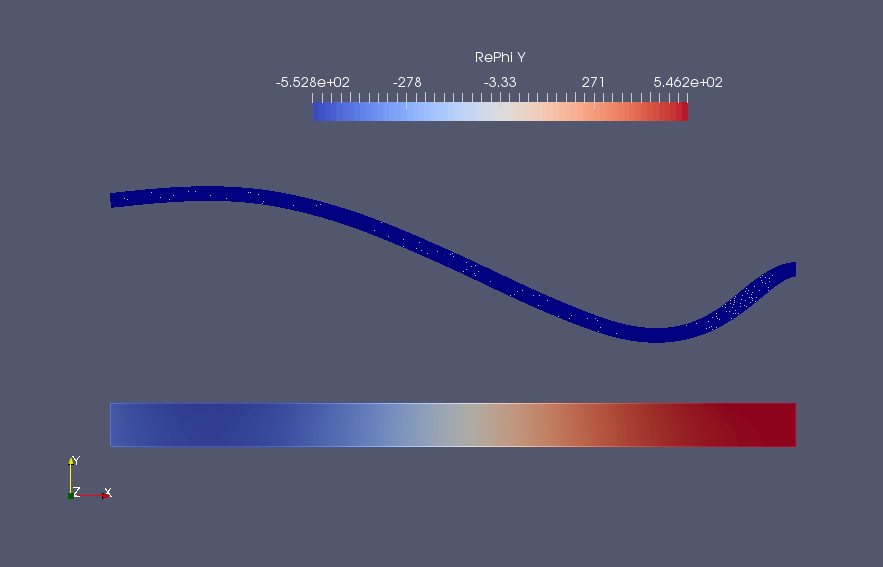
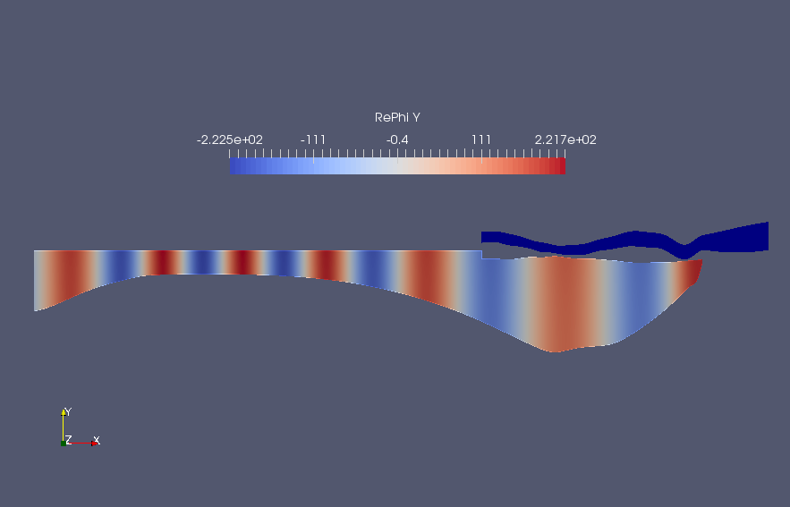

# iceFEM [](https://zenodo.org/badge/latestdoi/256385996) [](https://joss.theoj.org/papers/a75e3345a2565e1dcd114c965d7db1e7)           
## Dependencies
- [**FreeFem**](https://freefem.org): A high level multiphysics finite element software. Full version with the `MPI` implementation and the `ffddm` module is required. The full version can be downloaded from the official website.
- [**Bedmap2 Toolbox**](https://au.mathworks.com/matlabcentral/fileexchange/42353-bedmap2-toolbox-for-matlab): To obtain real--life shelf/cavity data. This is available as a MATLAB toolbox.
- **MATLAB**: This is really not a constraint if you are using the package without the BEDMAP2 plugin. Interpolation and related operations can be done using other packages. However, a list of `MATLAB` scripts are available for this purpose to make things easier.
- **Unix based OS:** Currently this program is written assuming a Unix based Operating system. Future support for windows will be added.

## Introduction

This iteration of iceFEM implements the algorithms in parallel with an aim to solve bigger problems. For this implementation, the program requires the ``MPI`` version of FreeFem installed. If the full program is installed, the parallel version is available by default. For the main branch visit the link [here](https://github.com/Balaje/iceFem/tree/master). To download the latest release (this could be a development release and some components may not work properly) package, use

``` shell
wget https://github.com/Balaje/iceFem/archive/refs/tags/2.0.1.zip -O icefem.zip
unzip -q icefem.zip
```

The schematic and the governing equations remain the same as the previous version and is shown in the Figure below.

| 
| ----------------------------------

**A few sample programs are discussed below to get you started**. To setup and use the package, cd into the package directory, open up terminal and type

```shell
export FF_INCLUDEPATH="$PWD/include" #Add the include/ folder into the FreeFem++ environment variable. Needs to be run for the first time.
./genDir.sh [YOUR_DIRECTORY NAME]
```

The `genDir.sh` script creates the directory structure used by the package to write the relevant files.

```shell
./genDir.sh 1_SIMPLE5
```
produces the following directories inside.

``` shell
1_SIMPLE5/ # This folder also contains the VTK files for visualizing the FreeFem solution.
├── 2_Deformation
├── 2_Modes # To store in-vacuo modes
├── 2_ModesMatrix # [FEM] To store the reduced system.
│   ├── Interpolated_F # [MATLAB] Store the interpolated RHS value
│   ├── Interpolated_H # [MATLAB] Store the interpolated LHS value
│   └── Interpolated_L # [MATLAB] Store the interpolated solutions $\lambda_j$
├── 2_Potential # To store the radiation and diffraction potentials
├── 2_RefCoeff # [FEM] To store the reflection coefficients
│   ├── Interpolated_R # [MATLAB] To store the interpolated values of the Difraction and radiation reflection coefficients.
│   ├── RefCoeff_Dif # [FEM] To store the Diffraction reflection coefficients
│   └── RefCoeff_Rad # [FEM] To store the Radiation reflection coefficients
└── 2_Stresses # [FEM] To store the stresses
```
The working directory can be setup directly from the code using the `setupWorkingDir` macro.

```cpp
setupWorkingDir("1_SIMPLE5/")
SolutionDir="1_SIMPLE5/";
```

The default directory name can be changed in the FreeFem code by setting the variable `SolutionDir` in the program. Run
```shell
mpirun -np 2 FreeFem++-mpi -v 0 iceshelf2d.edp -nev 8 -Tr 80 -hsize 0.05 -isUniRef 0 -isSplit 1 -N 15
```
This command command computes the solution for a default uniform ice-shelf and cavity with

* Length L=20 km
* Thickness h=200 m
* Cavity Depth H=800 m
* Incident Wave period T=200 s

To specify more inputs, one can use the following command

```shell
mpirun -np 2 FreeFem++-mpi -ne -v 0 iceshelf2d.edp -L [LENGTH] -H [DEPTH OF CAVITY] -h [THICKNESS OF ICE]
                                 -N [MESH PARAM]
                                 -Tr [REAL(period)] -Ti [IMAG(period)]
                                 -iter [SOL. INDEX]    
                                 -isSplit [ON/OFF DOMAIN SPLITTING]
                                 -notchHeight [HEIGHT_FRAC_THICKNESS]
                                 -notchWidth [HEIGHT_FRAC_THICKNESS]
                                 -notchLoc [LOC_FRAC_LENGTH]         
```
The notch dimensions are only available in the `iceBEDMAP2` macro. To specify the dimension of the problem and the polynomial order of approximation, define the following macros in the code

```cpp
macro dimension 2//EOM" (dim=2)
macro fspace 2//EOM" (fespace=P2)
```

to solve a 2D problem using quadratic triangular elements. Note that FreeFem offers support only for triangles/tetrahedrons. The non-local boundary condition has been extended to accommodate  more general cases.

The same code can be used to solve a variety of problems, including 2D/3D icebergs, ice-shelves

**Example 1: Ice shelf motion**

```shell
mpirun -np 4 FreeFem++-mpi -ne -v 0 iceshelf2d.edp -L 10000 -H 800 -h 200 -N 10 -Tr 200 -Ti 0 -iter 0 -hsize 0.04 -isSplit 1
```

The parameter ``hsize`` is used in uniform refinement of the ice and cavity meshes and is used by the macro ```refineMesh```. A better method will be added in future releases. Splitting is employed to parallelise the computation of the reduced system. For a set of space-dimensional parameters for example, length, thickness of the ice shelf, splitting can be done once. This is achieved using the macro,

``` cpp
splitMesh(isSplit);
```
where ```isSplit``` is a global variable that indicates whether the splitting is active or not. The splitting macro will split the mesh and distribute the sub-meshes among the processors. The following data for the reflection coefficient is obtained. The thin-plate solution is shown as comparison to the FEM result.

Model | Reflection Coefficient, `R` | abs(`R`) |
---- |----- | ---- |
FEM | (0.482959,0.875643) | 1.000000 |
Thin Plate| (0.493626,0.869740) | 1.000000 |

All the visualization is performed using Paraview. The code produces the following outputs for the displacement field and the velocity potential in the cavity region.

| Displacement/Potential (FEM) | Displacement (ThinPlate) |
| --- | ---- |
|   |  |


**Example 2: Floating elastic plate Motion**

The same code can used to model motion of icebergs. Add the line

```cpp
iceshelf2iceberg;
```

to switch the mesh to an iceberg. This simply replaces the clamped condition on  the ice-shelf to a free-boundary condition (`label=2` to `label=1`) and the no-flow boundary on the clamped end of the cavity is replaced by the outlet boundary condition (`label=6` to `label=5`).

Run:
```shell
mpirun -np 4 FreeFem++-mpi -ne -v 0 iceshelf2d.edp -L 10000 -H 800 -h 200 -N 10 -Tr 80 -Ti 0 -iter 0 -hsize 0.04 -isSplit 1
```
solves the floating elastic plate vibration problem for an incident period of ``T=80s``. The output will be something similar to the Figure below:

| 
| -----------

The reflection (`R`) and transmission (`T`) coefficients are shown in the Table below:

T(in s) | `R`(omega) | `T`(omega) | abs(`R`)^2+abs(`T`)^2 |
--- | --- | --- | --- |
T=40 s | (0.0975578,-0.0654793) | (-0.553401,-0.82469) | 1.00009 |

which verifies the energy conservation result. Note that the transmission coefficient `T=0` in ice--shelf case since there is no transmission. The Q-operator boundary condition is applied on both the ends while the wave forcing function is applied only on the left hand side (inlet boundary).


## BEDMAP2 Integration

Real-life ice-shelf profiles can be obtained using the BEDMAP2 dataset to generate the finite element meshes. Download the BEDMAP2 dataset [here](https://www.mathworks.com/matlabcentral/fileexchange/42353-bedmap2-toolbox-for-matlab). The BEDMAP2 dataset is integrated with the code in a similar fashion to the [main branch](https://github.com/Balaje/iceFem/tree/master#bedmap2-integration). The profiles are generated using the MATLAB code ```bedMapProfile.m```. Once the profiles are generated, the resulting problem could be solved using the FreeFem code.

A sample profile has been added in the ```Meshes/BEDMAP2/``` folder. The sample profiles include the cavity region beyond the ice shelf. Again the same script can be used to model a BEDMAP2 problem. Instead of the code block to set linear thicknening ice, we use the `iceBEDMAP2()` macro instead.

``` cpp
/*
setProblem; //To setup an example problem.
real d1=-0.9*tth, f1=0.1*tth;
real d2=-0.9*tth, f2=0.1*tth;
real H1=-HH, H2=-HH;
setLinearThickeningIce(d1, d2, f1, f2);
setLinearThickeningCavity(H1, H2, d1, d2);
*/

iceBEDMAP2(6,1); //6 indicates the number of borders in the cavity mesh.
                 //4 if the mesh is restricted under the shelf.
```

Then run without specifying the dimensions of the ice-shelf
``` shell
mpirun -np 4 FreeFem++-mpi -v 0 iceshelf2d.edp -Tr 200 -isSplit 1 -iter 0
mpirun -np 4 FreeFem++-mpi -v 0 iceshelf2d.edp -Tr 4000 -isSplit 1 -iter 0
```

and it produces the following outputs. Note the scales along the ``y`` axis is exaggerated for better visualization.

| T=200 s | T=4000 s |
| --- | --- |
|  |  |

The reflection coefficients are tabulated below:

T | Reflection Coefficient, `R` | abs(`R`) |
---| ---- | ---- |
200 s| (-0.12685,-0.991929) |  1.00001|
4000 s | (-0.983021,-0.183491) | 1.00000 |

## Time domain simulations

Simple time-domain simulations can be run using the current version. Create a raw file **(Eg. FAmp.dat)** containing 3 columns - the frequency space, the amplitude as a function of frequency and the phase associated with the frequency. Then use the routine

```cpp
real dt=1, T=100;
real[int] time=-T:dt:T;
constructTimeDomainSol("FAmp.dat",time)
```

where `time` is the input time. This writes a series of files `time_0.vtk`, `time_1.vtk`, etc. in the working directory. Paraview can then be used to create movies to visualize the time domain solution. Here is a sample movie **(click on the image!)** comparing an ice-shelf and an iceberg motion along with the von-mises stress, subject to the same incident wave forcing.

| [](https://www.youtube.com/watch?v=bk8VWGwTi48)
| --

A script to generate the time-domain files is given in `timeDomain.edp`. A detailed tutorial will be provided in the manual soon.

## 3D Problems (Ongoing work)

3D problems are much more challenging to solve that 2D problems. The eigenmode decomposition of the ice-shelf typically consists of lower order vibration modes in the third direction. The modal decomposition often yield these vibration modes in an arbitrary order and thus simple solutions to the frequency domain problems are often harder to approximate. Hence, more analysis (including validation) is required to study these problems in detail. Nevertheless, preliminary support has been extended to 3D cases as well.

Change/Add/Comment following lines in the 2D code:

```cpp
macro dimension 3//EOM" Set dimension 3
macro fspace 1//EOM" Set fspace 1. fspace 2 does not work due to some bug.
//refineMesh; //Comment out refineMesh.
```

Run the code, for example

``` shell
mpirun -np 2 FreeFem++-mpi -ne -v 0 iceshelf2d.edp -L 10000 -H 800 -h 200 -N 3 -Tr 200 -Ti 0 -iter 0 -isSplit 1
```

should solve the problem and return

Reflection coefficient, R | abs(R) |
-- | -- |
(-0.475759,0.882548) | 1.00261 |


#### An Example:

*Checkout the branch [`ParIceFem`](https://github.com/Balaje/iceFem/tree/ParIceFem#3d-problems) for another example.*

This is an example time-domain simulation ran using the package. **Click on the image to view the movie.**

| [](https://youtu.be/cZX5naD8r5I)
| --

## Acknowledgement
This is joint work with my supervisors:

- [Mike Meylan](https://www.newcastle.edu.au/profile/mike-meylan), University of Newcastle.
- [Bishnu Lamichhane](https://www.newcastle.edu.au/profile/bishnu-lamichhane), University of Newcastle.
- [Luke Bennetts](https://luke-bennetts.com/), University of Adelaide.

## Contact:
- If there are any issues contact, Balaje K,  [balaje6@gmail.com](mailto:balaje6@gmail.com), or use the issue tracker to raise an issue.
